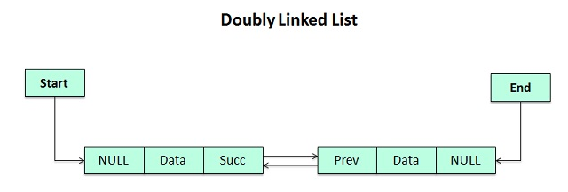

# Data Structure

## Array
An array is defined as a set of a definite number of homogeneous elements or data items. It means an array can contain one type of data only, either all integers, all floating-point numbers, or all characters. Declaration of an array is as follows:
```C
int a [10];
```

The individual elements of an array can be accessed by describing the name of the array, followed by index or subscript (determining the location of the element in the array) inside the square brackets. For example, to retrieve 5th element of the array, we need to write a statement `a[4]`.


## Linked List
Linked list is a particular list of some data elements linked to one other. In this every element point to the next element which represents the logical ordering. Each element is called a node, which has two parts

INFO part which stores the information and POINTER which points to the next element. As you know for storing address, we have a unique data structures in C called pointers. Hence the second field of the list must be a pointer type.




## Arrays vs. Linked List

|BASIS FOR COMPARISON|	ARRAY|	LINKED LIST|
|--|--|--|
|Basic|It is a consistent set of a fixed number of data items. |It is an ordered set comprising a variable number of data items.|
|Size|	Specified during declaration.|	No need to specify; grow and shrink during execution.|
|Storage| Allocation|	Element location is allocated during compile time.	Element position is assigned during run time.|
|Order of the elements|	Stored consecutively|	Stored randomly|
|Accessing the element|	Direct or randomly accessed, i.e., Specify the array index or subscript.|	Sequentially accessed, i.e., Traverse starting from the first node in the list by the pointer.|
|Insertion and deletion of element|	Slow relatively as shifting is required.|Easier, fast and efficient.
|Searching|	Binary search and linear search|	linear search|
|Memory required|	Less|	More|
|Memory Utilization|	Ineffective|	Efficient|